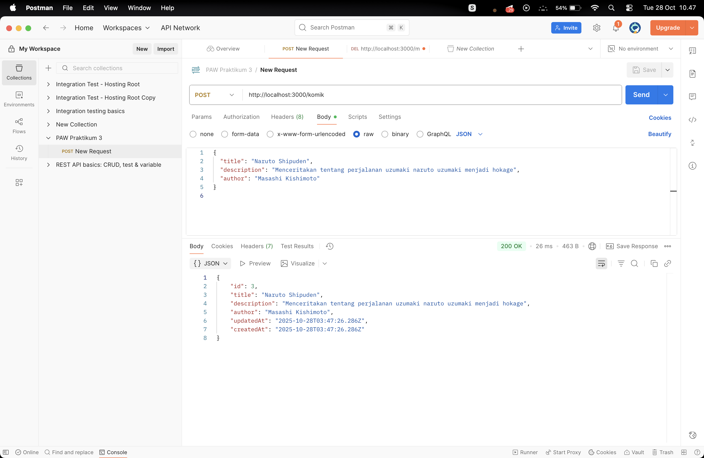
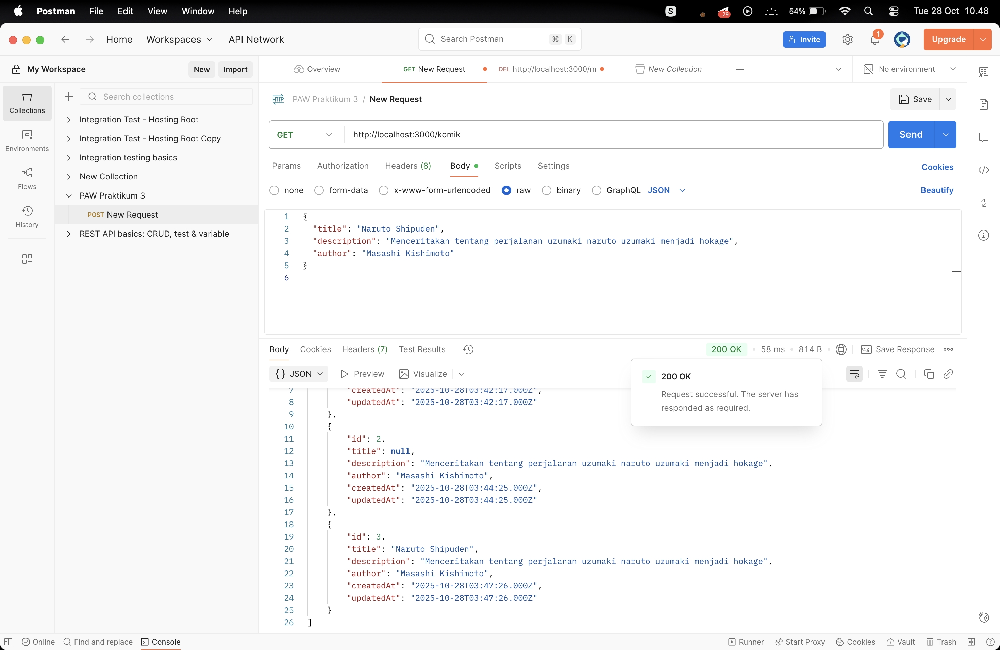
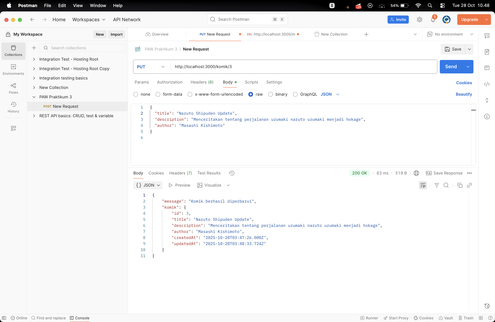
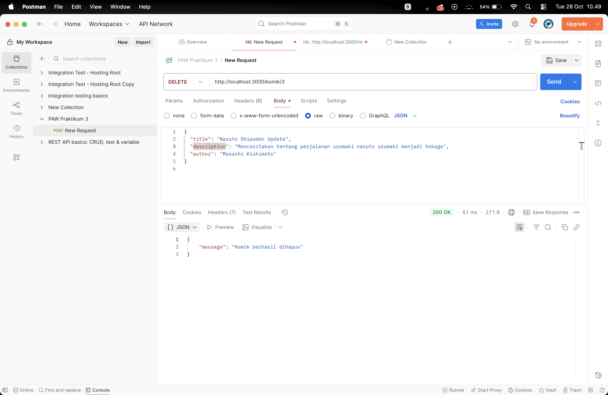

# 🖼️ Screenshot CRUD Komik API

Berikut hasil pengujian endpoint menggunakan Postman, urut sesuai operasi **POST → GET → PUT → DELETE**.

---

## 1️⃣ POST /komik
Menambahkan data komik baru.  

---

## 2️⃣ GET /komik
Menampilkan semua data komik.  

---

## 3️⃣ PUT /komik/:id
Mengubah data komik berdasarkan ID.  

---

## 4️⃣ DELETE /komik/:id
Menghapus data komik berdasarkan ID.  

